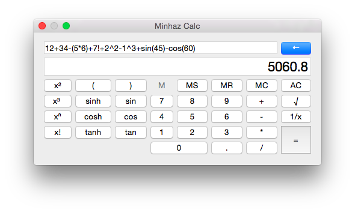

# SimpleScientificCalculator

A real simple scientific calculator written in Qt and Lepton

# Functions

* Basic add, subtract, multiply and division
* Square, Cube, Power to N, Factorial
* Sine, Cosine, Tangent and reverse of them
* Memory Save, Recall and Clear
* Parenthesis support

## Screenshot ##

# Lepton

[Lepton](https://simtk.org/home/lepton) is written and licensed by [Peter Eastman](https://simtk.org/users/peastman)